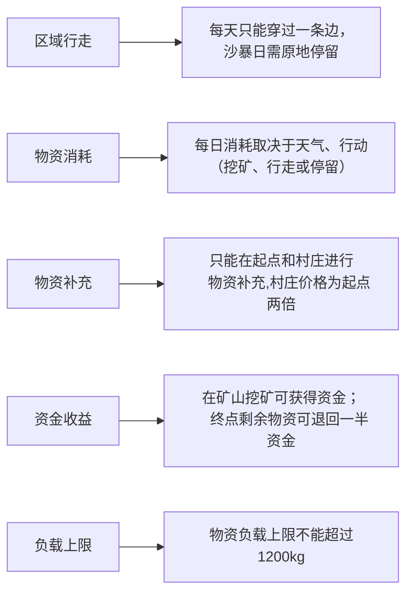

#### 摘要

------

“穿越沙漠”是一款生存型游戏，需要选择最佳游戏策略，使玩家在保证到达终点的情况下尽可能获得更多资金。针对“穿越沙漠”问题中不同信息条件下的路径规划、资源配置与多人协同行动决策，本文以剩余资金最大化为核心目标，建立了单人确定性决策模型、单人随机决策模型以及多人协同优化模型，对不同关卡情形下的最优策略进行了系统研究。首先，根据地图中各区域的邻接关系构建无向图模型，利用 **Dijkstra 算法**求解起点、村庄、矿山与终点之间的最短路径，为后续策略优化提供路径基础。

对于问题一，在已知全时段天气信息的条件下，综合考虑负重约束、资源消耗约束、资金约束及到达终点的时限约束，建立以最终剩余资金最大化为目标的动态规划模型。模型对“直接前往终点”与“经矿山挖矿增益后再前往终点”两类策略进行统一刻画，使用**动态规划**，通过状态转移递推求解各阶段的最优行动方案，从而得到单人情形下的全局最优决策。

对于问题二，在仅知道当天天气、未来天气具有随机性的条件下，将天气演化过程引入**马尔可夫决策**思想，建立基于状态转移概率的动态决策模型。模型结合当前位置、剩余资源、剩余天数及资金状态，对“前进、停留、挖矿、补给”等动作进行滚动优化，从而获得不确定天气条件下的最优策略，提高了模型在动态环境中的适应能力。

对于问题三，考虑多人同时参与时因同行、同购和同矿带来的资源消耗放大与收益分摊效应，我们选择合作而非竞争的的博弈模式，在单人模型基础上建立多人协同优化框架。进一步采用**蒙特卡洛方法**模拟天气过程，对不同随机天气样本下的多人协同行为进行数值实验，从而评估策略的稳定性与收益表现。结果表明，所建模型能够较好统筹路径选择、资源补给与行动安排，在确定与不确定天气条件下均具有较强的适用性与可解释性。

本文提出的模型将最短路径搜索、动态规划、马尔可夫决策与蒙特卡洛模拟有机结合，可为复杂环境下的资源受限路径优化与群体协同决策问题提供参考。

**关键词：**Dijkstra算法；动态规划；马尔可夫决策；蒙特卡洛模拟；路径优化；资源配置

------

#### 问题重述

##### 1.1 问题背景与游戏规则

“穿越沙漠”是一个以资源受限条件下路径规划与决策优化为核心的策略类游戏。玩家需要在给定地图上，从起点出发，穿越沙漠并最终到达终点。游戏过程中，玩家必须合理安排每日行动、购买和消耗水与食物，并结合天气变化、村庄补给和矿山挖矿等机制制定最优策略，以保证在规定期限内完成穿越任务，同时尽可能保留更多资金。具体规则如下：

此外，在多名玩家的情况下，还存在同行物资消耗翻倍、多人同时挖矿收益压缩等规则。

##### 1.2 需要解决的问题

根据题目设定，需要针对不同信息条件和参与人数建立相应模型，为玩家制定最优或近优策略，使其在成功到达终点的前提下剩余资金尽可能多。具体需要解决如下问题：

**问题一：单人、天气完全已知情形。**
 假设仅有一名玩家参与游戏，且在整个游戏周期内每天的天气状况均已提前知道。需要在已知天气序列、地图结构、资源价格、负重上限和截止日期的前提下，确定玩家每天的最优行动方案，包括是否移动、是否停留、是否前往村庄补给、是否前往矿山挖矿，以及初始阶段应购入多少水和食物，并对附件中的前两关进行求解。

**问题二：单人、天气部分未知情形。**
 假设仍只有一名玩家，但玩家仅知道当天的天气，而无法提前获知未来天气状况，只能根据当前状态决定当天行动。此时需要建立适用于随机天气环境下的动态决策模型，使玩家能够依据当前位置、剩余资源、剩余资金和剩余时间实时调整策略，并对附件中的第三关和第四关进行讨论。

**问题三：多人、天气已知情形。**
 当有多名玩家同时从起点出发，且天气信息完全已知时，每位玩家的行动方案需在第1天确定后不再改变。由于多人同行、同矿和同村补给会引起资源消耗、收益和价格变化，因此需要建立多人协同优化模型，确定各玩家应采取的路径与分工策略，并对附件中的第五关进行具体分析。

**问题四：多人、天气部分未知情形。**
 假设多名玩家仅知道当天的天气状况，并且从第2天起，所有玩家在每天结束后都可以获知其他玩家当日的行动方案及剩余资源情况，然后再决定下一天的行动。这一情形下，玩家之间既存在竞争，也存在一定的信息互动与协同关系。需要建立适用于动态博弈环境的决策模型，研究一般情况下玩家应采取的策略，并对附件中的第六关进行讨论。

------

#### 问题分析

本题本质上是一个带有资源约束和时间约束的动态路径优化问题。玩家在穿越过程中不仅要决定“走哪条路”，还要同步决定“何时停留、何时补给、何时挖矿”，因此其决策变量同时涉及路径选择、物资配置与时序安排。

由于地图中任意两个关键节点之间存在多条可行路线，而后续动态决策均建立在路径可达性的基础上，故本文先利用 Dijkstra 算法求出起点、村庄、矿山和终点之间的最短路径，将复杂地图搜索问题转化为关键节点之间的路径预处理问题，在此基础上解决后续路径规划问题。

##### 2.1 问题一分析

第一问中由于天气序列完全已知，可将每日位置、剩余水食物资、资金与天数视为状态量，建立动态规划模型，通过递推比较“前进—停留—挖矿—补给”等行动的收益与代价，求解单人确定情形下的最优策略。你们当前论文也已明确将第一问归结为递推型单目标优化问题，并采用动态规划求解。

##### 2.2 问题二分析

第二问中未来天气未知，题目由确定性优化转化为随机动态决策问题，因此需要在状态转移中引入天气的不确定性，用马尔可夫决策思想描述“当前状态—行动选择—未来状态”的演化过程，使玩家能够依据当天天气和当前资源状况滚动调整策略。

##### 2.3 问题三分析

第三问进一步加入多名玩家同时行动时的同行、同矿、同购惩罚，使问题由单人最优扩展为多主体耦合优化问题，不再只追求单条最优路径，而要综合考虑玩家之间的分工、错峰和协同；同时，由于天气过程具有随机性，本文采用蒙特卡洛方法模拟多种天气样本，对多人策略在不同天气实现下的收益与稳定性进行评估。

第五关在天气已知的前提下，分析挖矿收益与需要多消耗物资的关系，确定挖矿亏损，选择直达终点。在次基础上再考虑多人同行惩罚，采用一人停留来换取团队最大总收入，采用合作而非竞争的博弈策略。

第六关对于天气未知情况的三人决策，由于存在同行消耗惩罚和收益惩罚，故也采用合作，让一人挖矿，两人直达的方案进行。通过对天气情况与消耗的分析，确定是否需要补给以及补给次数，最后给出一般情况下的最优路径。

------

#### 模型假设

1. 不考虑途中资源损耗、丢失及额外获取等特殊情况。
2. 导致游戏无法进行的极端沙暴天气不会出现
3. 除题目说明的价格变化外，不考虑其他额外成本
4. 在蒙特卡洛模拟中，各次天气样本相互独立，可视为对真实天气过程的合理近似。

------

#### 模型分析与评价

##### 模型优点

1. 采用Dijkstra算法对地图进行预处理，简化路径，避免计算量过大；
2. 通过负重重量进行回溯路径、采购数量等，记录方案详细内容，从而找到最优解；
3. 第二问中引入马尔可夫模型参与决策，引入概率这一因素建立了基于期望的最大化收益模型，将不确定的问题通过随机确定的方式化解；
4. 第三问采用蒙特卡洛算法随机模拟天气，，从而给出一般天气状况下的最佳方案
5. 第三问先进行数值分析，确定合作而非竞争的博弈关系，将多人问题最优解降维为单人最优路径规划，并引入联盟稳定性指标进行验证

##### 模型缺点

1. 运用蒙特卡洛进行天气预测时，必须给定各天气概率，预测结果准确性有待提升
2. 问题三采用整体收益最大化为目标，个体收益不一定最大，且未考虑多人错峰挖矿的情况
3. 问题三仅限于小基数玩家的讨论，未考虑大基数玩家的情况，模型普适性有待提高

